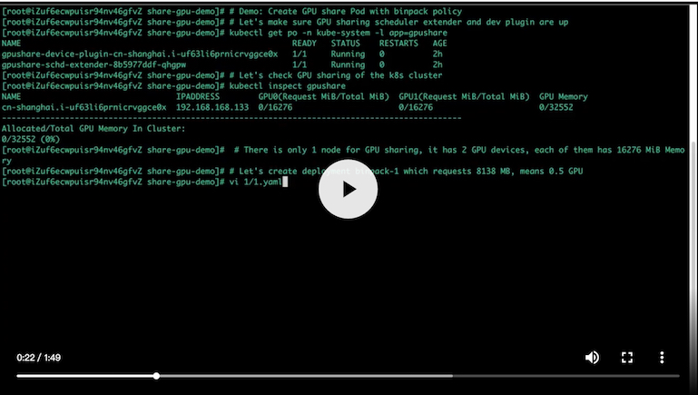
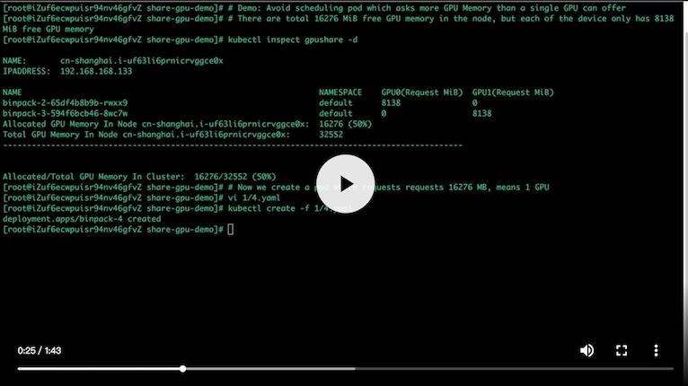

# GPU Sharing Scheduler Extender in Kuberntes 

[](https://travis-ci.org/AliyunContainerService/gpushare-scheduler-extender) 
[](https://goreportcard.com/report/github.com/AliyunContainerService/gpushare-scheduler-extender)


## Overview

More and more data scientists run their Nvidia GPU based inference tasks on Kubernetes. Some of these tasks can be run on the same Nvidia GPU device to increase GPU utilization. So one important challenge is how to share GPUs between the pods. The community is also very insterested in this [topic](https://github.com/kubernetes/kubernetes/issues/52757).

Now there is a GPU sharing solution on native Kubernetes you can take. it is based on scheduler extenders and device plugin mechanism, so you can reuse this solution easiliy in your own Kubernetes. 

## Prerequisites

- Kubernetes 1.11+
- golang 1.10+
- NVIDIA drivers ~= 361.93
- Nvidia-docker version > 2.0 (see how to [install](https://github.com/NVIDIA/nvidia-docker) and it's [prerequisites](https://github.com/nvidia/nvidia-docker/wiki/Installation-\(version-2.0\)#prerequisites))
- Docker configured with nvidia as the [default runtime](https://github.com/NVIDIA/nvidia-docker/wiki/Advanced-topics#default-runtime).

## Design

For more details about the design of this project, please read the [Design](docs/designs/designs.md).

## Setup

You can follow the [Installation Guide](docs/install.md).

## User Guide

You can check the [User Guide](docs/userguide.md) to know how to use it.

## Developing

### Scheduler Extender

```
# git clone https://github.com/AliyunContainerService/gpushare-scheduler-extender.git && cd gpushare-scheduler-extender
# docker build -t cheyang/gpushare-scheduler-extender .
```

### Device Plugin

```
# git clone https://github.com/AliyunContainerService/gpushare-device-plugin.git && cd gpushare-device-plugin
# docker build -t cheyang/gpushare-device-plugin .
```

### Kubectl Extension

- golang > 1.10

```
# mkdir -p $GOPATH/src/github.com/AliyunContainerService
# cd $GOPATH/src/github.com/AliyunContainerService
# git clone https://github.com/AliyunContainerService/gpushare-scheduler-extender.git
# cd gpushare-scheduler-extender
# go build -o $GOPATH/bin/kubectl-inspect-gpushare-v2 cmd/inspect/*.go
```

## Demo

### - Demo 1: Deploy multiple GPU Shared Pods, and they are scheduled to the same GPU device in binpack way 

[](http://cloud.video.taobao.com//play/u/2987821887/p/2/e/6/t/1/214292079721.mp4)

### - Demo 2:  Avoid GPU Memory requests can fit the node level, but not for the GPU device level

[](http://cloud.video.taobao.com//play/u/2987821887/p/2/e/6/t/1/214235285109.mp4)

## Related Project

- [gpushare device plugin](https://github.com/AliyunContainerService/gpushare-device-plugin.git)

## Roadmap

- Integrate Nvidia MPS as the option for isolation
- Automated Deployment for the Kubernetes cluster which is deployed by kubeadm
- Scheduler Extener High Availablity
- Generic Solution for GPU, RDMA and other devices

## Acknowledgments

- GPU sharing solution is based on [Nvidia Docker2](https://github.com/NVIDIA/nvidia-docker), and their [gpu sharing design](https://docs.google.com/document/d/1ZgKH_K4SEfdiE_OfxQ836s4yQWxZfSjS288Tq9YIWCA/edit#heading=h.r88v2xgacqr) is our reference. The Nvidia Community is very supportive and We are very grateful.
